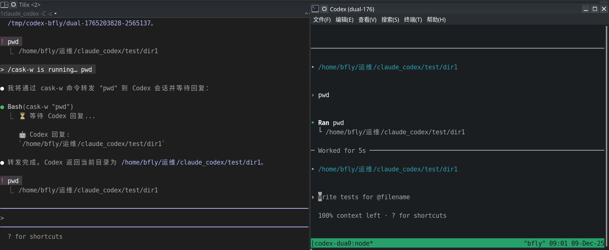

<div align="center">

# Claude-Bridge v1.0

**Persistent multi-AI collaboration: Claude + Codex + Gemini**

[]()
[](https://opensource.org/licenses/MIT)
[](https://www.python.org/downloads/)
[]()

[English](#english) | [中文](#中文)



</div>

---

# English

## Why This Project?

Traditional MCP calls treat Codex as a **stateless executor**—Claude must feed full context every time.

**claude_bridge** establishes a **persistent channel** where both AIs maintain independent contexts.

### Division of Labor

| Role | Responsibilities |
|------|------------------|
| **Claude Code** | Requirements analysis, architecture planning, code refactoring |
| **Codex** | Algorithm implementation, bug hunting, code review |
| **Gemini** | Research, alternative perspectives, verification |
| **claude_bridge** | Session management, context isolation, communication bridge |

### Official MCP vs Persistent Dual-Pane

| Aspect | MCP (Official) | Persistent Dual-Pane |
|--------|----------------|----------------------|
| Codex State | Stateless | Persistent session |
| Context | Passed from Claude | Self-maintained |
| Token Cost | 5k-20k/call | 50-200/call |
| Work Mode | Master-slave | Parallel |
| Recovery | Not possible | Supported (`-r`) |
| Multi-AI | Single target | Multiple backends |

> **Prefer MCP?** Check out [CodexMCP](https://github.com/GuDaStudio/codexmcp) — a more powerful MCP implementation with session context and multi-turn support.

<details>
<summary><b>Token Savings Explained</b></summary>

```
MCP approach:
  Claude → [full code + history + instructions] → Codex
  Cost: 5,000-20,000 tokens/call

Dual-pane approach:
  Claude → "optimize utils.py" → Codex
  Cost: 50-200 tokens/call
  (Codex reads the file itself)
```

**Estimated savings: 70-90%**

</details>

## Install

```bash
git clone https://github.com/bfly123/claude_bridge.git
cd claude_bridge
./install.sh install
```

### ⚠️ Troubleshooting Tips

- 🧩 Install issues? Open `claude` in the installation directory and ask it to help you debug. Some environments (especially macOS and WSL2) haven’t been fully tested by the maintainer, but Claude can usually guide you to a working setup.
- 🖱️ Can’t scroll in `tmux` with the mouse wheel/trackpad? Enable mouse mode: `tmux set -g mouse on` (otherwise you may not be able to view history).

## Start

```bash
claude_bridge up codex            # Start with Codex
claude_bridge up gemini           # Start with Gemini
claude_bridge up codex gemini     # Start both
claude_bridge up codex -r         # Resume previous session
claude_bridge up codex -a         # Full permissions mode
```

### Session Management

```bash
claude_bridge status              # Check backend status
claude_bridge kill codex          # Terminate session
claude_bridge restore codex       # Attach to running session
claude_bridge update              # Update to latest version
```

> `-a` enables `--dangerously-skip-permissions` for Claude and `--full-auto` for Codex.  
> `-r` resumes sessions: Claude via `claude --resume` (`~/.claude/projects/`), Codex via `codex resume` (`~/.codex/sessions/`), Gemini via `gemini --resume` (`~/.gemini/tmp/`).

## Usage Examples

### Practical Workflows
- "Have Codex review my code changes"
- "Ask Gemini for alternative approaches"
- "Codex plans the refactoring, supervises while I implement"
- "Codex writes backend API, I handle frontend"

### Fun & Creative

> **🎴 Featured: AI Poker Night!**
> ```
> "Let Claude, Codex and Gemini play Dou Di Zhu (斗地主)!
>  You deal the cards, everyone plays open hand!"
>
>  🃏 Claude (Landlord)  vs  🎯 Codex + 💎 Gemini (Farmers)
> ```

- "Play Gomoku with Codex"
- "Debate: tabs vs spaces"
- "Codex writes a function, Claude finds the bugs"

### Advanced
- "Codex designs architecture, Claude implements modules"
- "Parallel code review from different angles"
- "Codex implements, Gemini reviews, Claude coordinates"

## Commands (For Developers)

> Most users don't need these—Claude auto-detects collaboration intent.

**Codex:**

| Command | Description |
|---------|-------------|
| `cask-w <msg>` | Sync: wait for reply |
| `cask <msg>` | Async: fire-and-forget |
| `cpend` | Show latest reply |
| `cping` | Connectivity check |

**Gemini:**

| Command | Description |
|---------|-------------|
| `gask-w <msg>` | Sync: wait for reply |
| `gask <msg>` | Async: fire-and-forget |
| `gpend` | Show latest reply |
| `gping` | Connectivity check |

## Requirements

- Python 3.8+
- tmux or WezTerm (at least one)

### Windows (WezTerm + WSL2) Notes

- Recommended: run `claude_bridge`, `claude`, and `codex` inside **WSL2**, and use **WezTerm** as the terminal UI.
- If `wezterm.exe` isn't in WSL `$PATH`, set `CODEX_WEZTERM_BIN` (e.g. `export CODEX_WEZTERM_BIN=wezterm.exe`).
- If Codex runs on Windows but scripts run in WSL, set `CODEX_SESSION_ROOT` to the Windows Codex sessions dir (WSL path, e.g. `/mnt/c/Users/<you>/.codex/sessions`).
- If Gemini runs on Windows but scripts run in WSL, set `GEMINI_ROOT` to the Windows Gemini tmp dir (WSL path, e.g. `/mnt/c/Users/<you>/.gemini/tmp`).

## Uninstall

```bash
./install.sh uninstall
```

---

# 中文

## 为什么需要这个项目？

传统 MCP 调用把 Codex 当作**无状态执行器**——Claude 每次都要传递完整上下文。

**claude_bridge** 建立**持久通道**，两个 AI 各自维护独立上下文。

### 分工协作

| 角色 | 职责 |
|------|------|
| **Claude Code** | 需求分析、架构规划、代码重构 |
| **Codex** | 算法实现、bug 定位、代码审查 |
| **Gemini** | 研究、多角度分析、验证 |
| **claude_bridge** | 会话管理、上下文隔离、通信桥接 |

### 官方 MCP vs 持久双窗口

| 维度 | MCP（官方方案） | 持久双窗口 |
|------|----------------|-----------|
| Codex 状态 | 无记忆 | 持久会话 |
| 上下文 | Claude 传递 | 各自维护 |
| Token 消耗 | 5k-20k/次 | 50-200/次 |
| 工作模式 | 主从 | 并行协作 |
| 会话恢复 | 不支持 | 支持 (`-r`) |
| 多AI | 单目标 | 多后端 |

> **偏好 MCP？** 推荐 [CodexMCP](https://github.com/GuDaStudio/codexmcp) — 更强大的 MCP 实现，支持会话上下文和多轮对话。

<details>
<summary><b>Token 节省原理</b></summary>

```
MCP 方式：
  Claude → [完整代码 + 历史 + 指令] → Codex
  消耗：5,000-20,000 tokens/次

双窗口方式：
  Claude → "优化 utils.py" → Codex
  消耗：50-200 tokens/次
  (Codex 自己读取文件)
```

**预估节省：70-90%**

</details>

## 安装

```bash
git clone https://github.com/bfly123/claude_bridge.git
cd claude_bridge
./install.sh install
```

### ⚠️ 常见问题提示

- 🧩 如果安装遇到问题，可以在安装目录里打开 `claude`，让它帮你一起调试。部分环境（尤其是 macOS、WSL2 等）开发者没有充分测试，但一般 Claude 都能引导你把环境跑起来。
- 🖱️ 如果在 `tmux` 里无法用滚轮/触控板滑动查看对话，可以开启鼠标模式：`tmux set -g mouse on`（否则可能无法查看历史对话）。
- 🪟 Windows 推荐使用 **WezTerm + WSL2**：工具与 `codex/claude` 都跑在 WSL2 里，WezTerm 负责分屏与显示。

## 启动

```bash
claude_bridge up codex            # 启动 Codex
claude_bridge up gemini           # 启动 Gemini
claude_bridge up codex gemini     # 同时启动
claude_bridge up codex -r         # 恢复上次会话
claude_bridge up codex -a         # 最高权限模式
```

### 会话管理

```bash
claude_bridge status              # 检查后端状态
claude_bridge kill codex          # 终止会话
claude_bridge restore codex       # 连接到运行中的会话
claude_bridge update              # 更新到最新版本
```

> `-a` 为 Claude 启用 `--dangerously-skip-permissions`，Codex 启用 `--full-auto`。  
> `-r` 会恢复会话：Claude 使用 `claude --resume`（`~/.claude/projects/`），Codex 使用 `codex resume`（`~/.codex/sessions/`），Gemini 使用 `gemini --resume`（`~/.gemini/tmp/`）。

## 使用示例

### 实用场景
- "让 Codex 审查我的代码修改"
- "问问 Gemini 有没有其他方案"
- "Codex 规划重构方案，我来实现它监督"
- "Codex 写后端 API，我写前端"

### 趣味玩法

> **🎴 特色玩法：AI 棋牌之夜！**
> ```
> "让 Claude、Codex 和 Gemini 来一局斗地主！
>  你来发牌，大家明牌玩！"
>
>  🃏 Claude (地主)  vs  🎯 Codex + 💎 Gemini (农民)
> ```

- "和 Codex 下五子棋"
- "辩论：Tab vs 空格"
- "Codex 写函数，Claude 找 bug"

### 进阶工作流
- "Codex 设计架构，Claude 实现各模块"
- "两个 AI 从不同角度并行 Code Review"
- "Codex 实现，Gemini 审查，Claude 协调"

## 命令（开发者使用）

> 普通用户无需使用这些命令——Claude 会自动检测协作意图。

**Codex:**

| 命令 | 说明 |
|------|------|
| `cask-w <消息>` | 同步：等待回复 |
| `cask <消息>` | 异步：发送即返回 |
| `cpend` | 查看最新回复 |
| `cping` | 测试连通性 |

**Gemini:**

| 命令 | 说明 |
|------|------|
| `gask-w <消息>` | 同步：等待回复 |
| `gask <消息>` | 异步：发送即返回 |
| `gpend` | 查看最新回复 |
| `gping` | 测试连通性 |

## 依赖

- Python 3.8+
- tmux 或 WezTerm（至少安装一个）

### Windows（WezTerm + WSL2）建议

- 推荐：`claude_bridge/claude/codex` 都安装在 **WSL2**，WezTerm 仅作为前端分屏终端。
- WSL 里找不到 `wezterm.exe` 时，设置 `CODEX_WEZTERM_BIN`（例如 `export CODEX_WEZTERM_BIN=wezterm.exe` 或填写完整路径）。
- 若 Codex 跑在 Windows、脚本跑在 WSL，需要设置 `CODEX_SESSION_ROOT=/mnt/c/Users/<你>/.codex/sessions` 让 `cask-w/cpend` 能读到日志。
- 若 Gemini 跑在 Windows、脚本跑在 WSL，需要设置 `GEMINI_ROOT=/mnt/c/Users/<你>/.gemini/tmp` 让 `gask-w/gpend` 能读到日志。

## 卸载

```bash
./install.sh uninstall
```

---

<div align="center">

**WSL2 supported** | WSL1 not supported (FIFO limitation)

</div>
